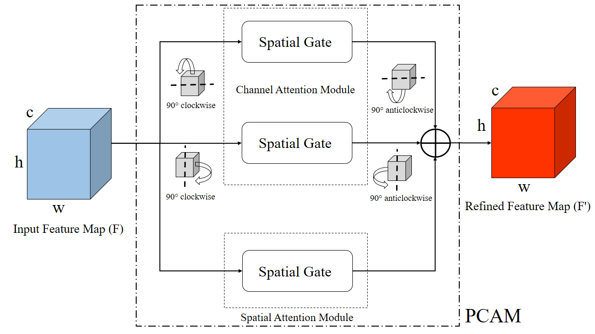
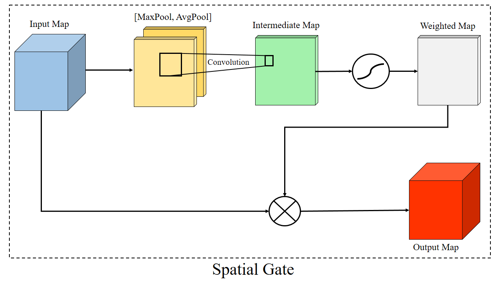
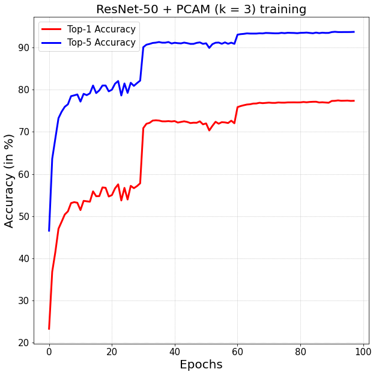
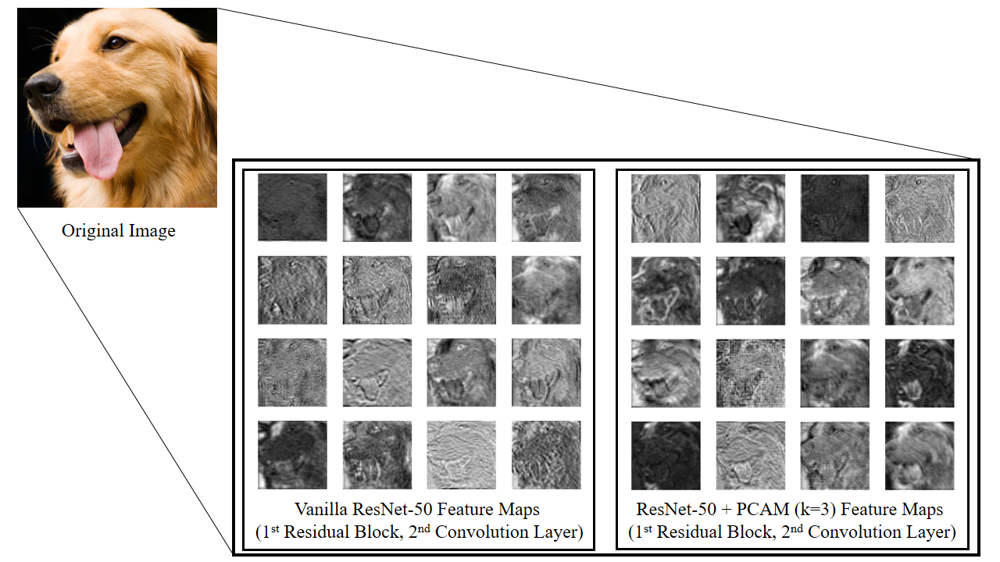

# PCAM - Permuted Convolution Attention Module

Authors - Diganta Misra 1†, Trikay Nalamada 1,2†, Ajay Uppili Arasanipalai 1,3†

1 - [Landskape](https://www.landskape.org/)     2. [IIT Guwahati](http://www.iitg.ac.in/)   3. [University of Illinois, Urbana Champaign](https://illinois.edu/)

† - Denotes Equal Contribution

    <em>Figure 1. The Proposed Permuted Convolution Attention Module (PCAM)</em>

    <em>Figure 2. Spatial Gate of PCAM</em>

  
  

    <em>Figure 3. From left to right:  a) Training Curve of ResNet-50 + PCAM (k=3) on ImageNet Classification. b) Feature Maps comparison for pretrained Vanilla ResNet-50 and pretrained ResNet-50 + PCAM (k = 3). </em>

## Pretrained Models:

|Model|Parameters|GFLOPs|Top-1 Error|Top-5 Error|Weights|
|:---:|:---:|:---:|:---:|:---:|:---:|
|ResNet-50 + PCAM (k = 3)|25.56 M|4.169|**22.662%**|**6.478%**|[Google Drive](https://drive.google.com/file/d/1wjQgkdqkUhnk_USq9e_fDwy62s64_Sq-/view)|
|ResNet-50 + PCAM (k = 3)*|25.56 M|4.131|**22.54%**|**6.324%**|[Google Drive](https://drive.google.com/file/d/1UX3q8gaherNJMhsd20vsgPjLXUIbZdKS/view?usp=sharing)|

* Model was trained for 98 epochs. 
