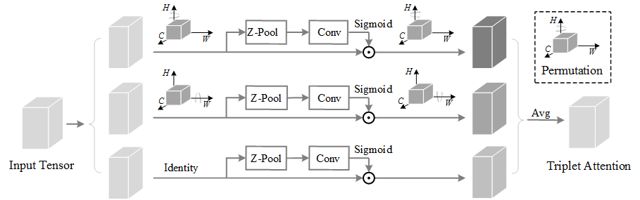
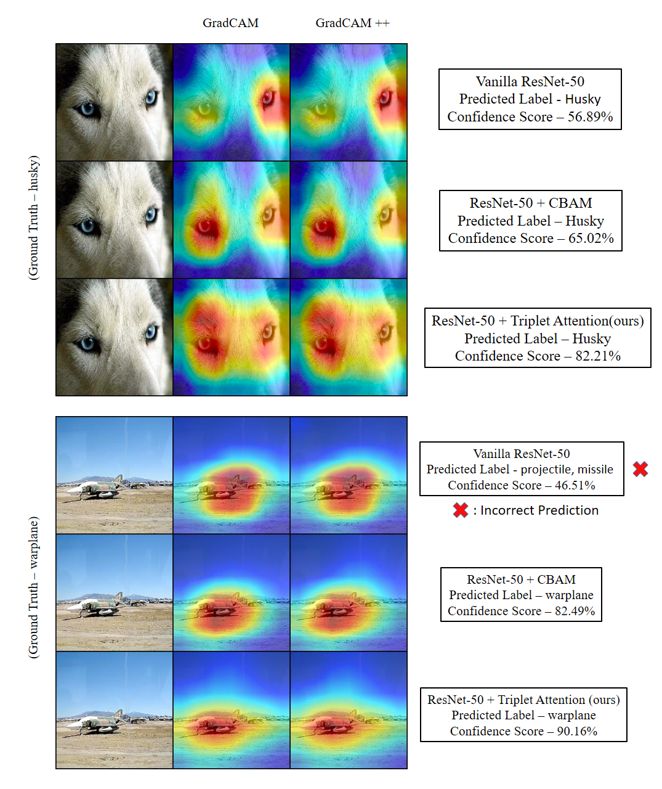

# Triplet Attention

  

Authors - Diganta Misra 1†, Trikay Nalamada 1,2†, Ajay Uppili Arasanipalai 1,3†, Qibin Hou 4

1 - [Landskape](https://www.landskape.org/)     2. [IIT Guwahati](http://www.iitg.ac.in/)   3. [University of Illinois, Urbana Champaign](https://illinois.edu/)   4. [National University of Singapore](http://www.nus.edu.sg/)

† - Denotes Equal Contribution

  

    <em>Figure 1. (a). Squeeze Excitation Block. (b). Convolution Block Attention Module (CBAM) (Note - GMP denotes - Global Max Pooling). (c). Global Context (GC) block. (d). Triplet Attention (ours). </em>

  

    <em>Figure 2. GradCAM and GradCAM++ comparisons for ResNet-50 based on sample images from ImageNet dataset. </em>

## Pretrained Models:

|Model|Parameters|GFLOPs|Top-1 Error|Top-5 Error|Weights|
|:---:|:---:|:---:|:---:|:---:|:---:|
|ResNet-50 + Triplet Attention (k = 7)|25.56 M|4.169|**22.52%**|**6.326%**|[Google Drive](https://drive.google.com/open?id=1ptKswHzVmULGbE3DuX6vMCjEbqwUvGiG)|
|ResNet-50 + Triplet Attention (k = 3)|25.56 M|4.131|**23.88%**|**6.938%**|[Google Drive](https://drive.google.com/open?id=1W6aDE6wVNY9NwgcM7WMx_vRhG2-ZiMur)|
|MobileNet v2 + Triplet Attention (k = 3)|3.5 M|3.506|**27.38%**|**9.23%**|[Google Drive](https://drive.google.com/file/d/1KIlqPBNLHh4qkdxyojb5gQhM5iB9b61_/view?usp=sharing)|
