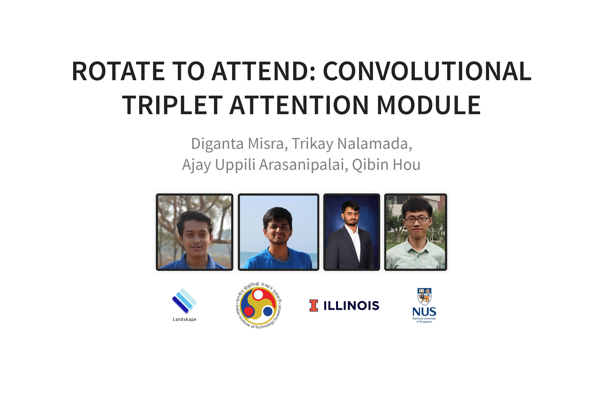
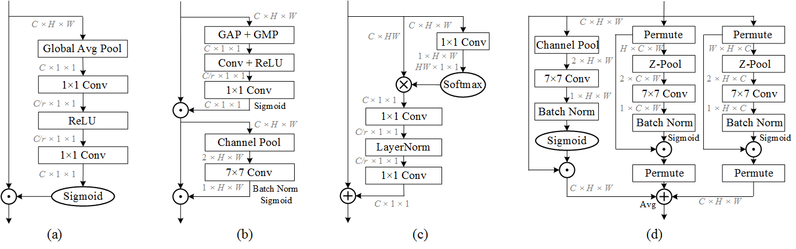
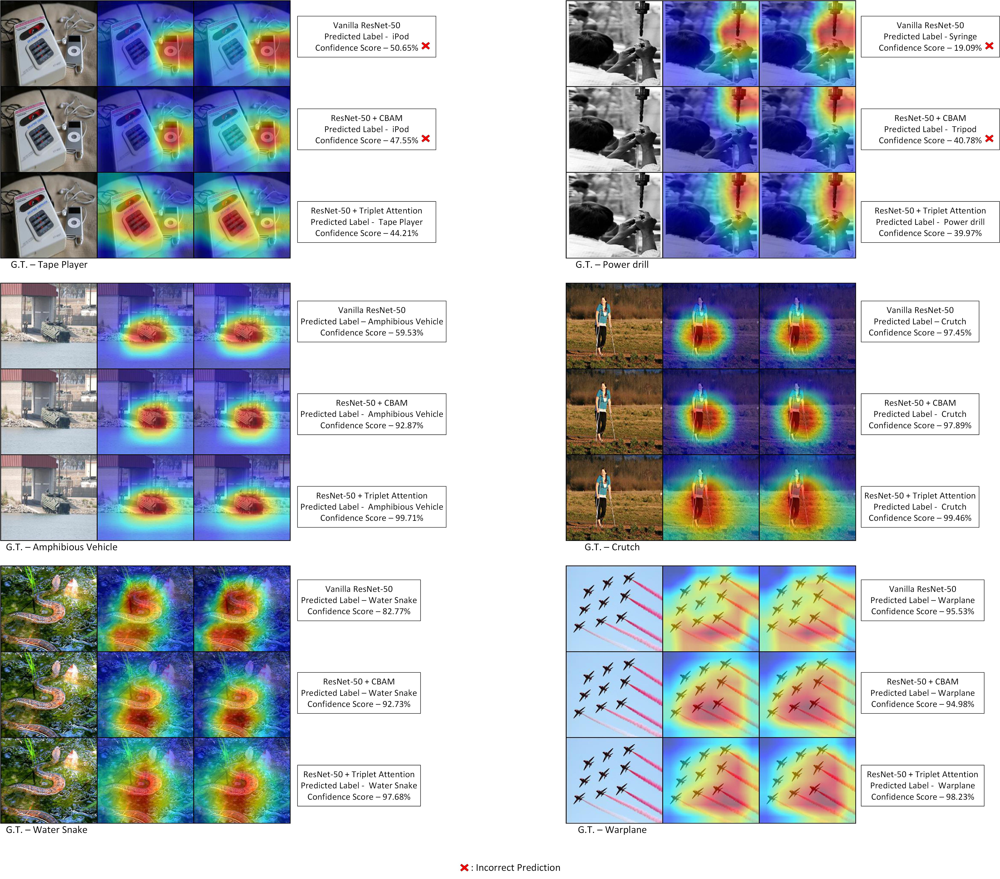

<p float="center">
  
</p>

<p float="center">
  <a href="https://openaccess.thecvf.com/content/WACV2021/html/Misra_Rotate_to_Attend_Convolutional_Triplet_Attention_Module_WACV_2021_paper.html" alt="CVF">
          </a>
  <a href="https://arxiv.org/abs/2010.03045" alt="ArXiv">
        </a>
  <a href="https://openaccess.thecvf.com/content/WACV2021/papers/Misra_Rotate_to_Attend_Convolutional_Triplet_Attention_Module_WACV_2021_paper.pdf" alt="PDF">
          </a>
  <a href="https://openaccess.thecvf.com/content/WACV2021/supplemental/Misra_Rotate_to_Attend_WACV_2021_supplemental.pdf" alt="Supp">
          </a>
  <a href="https://landskapeai.github.io/publication/triplet/" alt="Project">
          </a>
  <a href="https://landskapeai.github.io/slides/triplet/#/" alt="Slides">
          </a>
  <a href="https://youtu.be/ZW9_2bNF1zo" alt="Video">
          </a>
</p>

*Abstract - Benefiting from the capability of building inter-dependencies among channels or spatial locations, attention mechanisms have been extensively studied and broadly used in a variety of computer vision tasks recently. In this paper, we investigate light-weight but effective attention mechanisms and present triplet attention, a novel method for computing attention weights by capturing cross-dimension interaction using a three-branch structure. For an input tensor, triplet attention builds inter-dimensional dependencies by the rotation operation followed by residual transformations and encodes inter-channel and spatial information with negligible computational overhead. Our method is simple as well as efficient and can be easily plugged into classic backbone networks as an add-on module. We demonstrate the effectiveness of our method on various challenging tasks including image classification on ImageNet-1k and object detection on MSCOCO and PASCAL VOC datasets. Furthermore, we provide extensive in-sight into the performance of triplet attention by visually inspecting the GradCAM and GradCAM++ results. The empirical evaluation of our method supports our intuition on the importance of capturing dependencies across dimensions when computing attention weights.*

<p float="left">
  
</p>
<p>
    <em>Figure 1. Structural Design of Triplet Attention Module. </em>
</p>

<p float="left">
  
</p>
<p>
    <em>Figure 2. (a). Squeeze Excitation Block. (b). Convolution Block Attention Module (CBAM) (Note - GMP denotes - Global Max Pooling). (c). Global Context (GC) block. (d). Triplet Attention (ours). </em>
</p>


<p float="left">
  
</p>
<p>
    <em>Figure 3. GradCAM and GradCAM++ comparisons for ResNet-50 based on sample images from ImageNet dataset. </em>
</p>

*For generating GradCAM and GradCAM++ results, please follow the code on this [repository](https://github.com/1Konny/gradcam_plus_plus-pytorch).*

<details>
  <summary>Changelogs/ Updates: (Click to expand)</summary>
  
  * [05/11/20] v2 of our paper is out on [arXiv](https://arxiv.org/abs/2010.03045).
  * [02/11/20] Our paper is accepted to [WACV 2021](http://wacv2021.thecvf.com/home).
  * [06/10/20] Preprint of our paper is out on [arXiv](https://arxiv.org/abs/2010.03045v1).

   
</details>


## Pretrained Models:

### ImageNet:

|Model|Parameters|GFLOPs|Top-1 Error|Top-5 Error|Weights|
|:---:|:---:|:---:|:---:|:---:|:---:|
|ResNet-18 + Triplet Attention (k = 3)|11.69 M|1.823|**29.67%**|**10.42%**|[Google Drive](https://drive.google.com/file/d/1p3_s2kA5NFWqCtp4zvZdc91_2kEQhbGD/view?usp=sharing)|
|ResNet-18 + Triplet Attention (k = 7)|11.69 M|1.825|**28.91%**|**10.01%**|[Google Drive](https://drive.google.com/file/d/1jIDfA0Psce10L06hU0Rtz8t7s2U1oqLH/view?usp=sharing)|
|ResNet-50 + Triplet Attention (k = 7)|25.56 M|4.169|**22.52%**|**6.326%**|[Google Drive](https://drive.google.com/open?id=1ptKswHzVmULGbE3DuX6vMCjEbqwUvGiG)|
|ResNet-50 + Triplet Attention (k = 3)|25.56 M|4.131|**23.88%**|**6.938%**|[Google Drive](https://drive.google.com/open?id=1W6aDE6wVNY9NwgcM7WMx_vRhG2-ZiMur)|
|MobileNet v2 + Triplet Attention (k = 3)|3.506 M|0.322|**27.38%**|**9.23%**|[Google Drive](https://drive.google.com/file/d/1KIlqPBNLHh4qkdxyojb5gQhM5iB9b61_/view?usp=sharing)|
|MobileNet v2 + Triplet Attention (k = 7)|3.51 M|0.327|**28.01%**|**9.516%**|[Google Drive](https://drive.google.com/file/d/14iNMa7ygtTwsULsAydKoQuTkJ288hfKs/view?usp=sharing)|

### MS-COCO:

*All models are trained with 1x learning schedule.*

#### Detectron2:

##### Object Detection:

|Backbone|Detectors|AP|AP<sub>50</sub>|AP<sub>75</sub>|AP<sub>S</sub>|AP<sub>M</sub>|AP<sub>L</sub>|Weights|
|:---:|:---:|:---:|:---:|:---:|:---:|:---:|:---:|:---:|
|ResNet-50 + Triplet Attention (k = 7)|Faster R-CNN|**39.2**|**60.8**|**42.3**|**23.3**|**42.5**|**50.3**|[Google Drive](https://drive.google.com/file/d/1Wq_B-C9lU9oaVGD3AT_rgFcvJ1Wtrupl/view?usp=sharing)|
|ResNet-50 + Triplet Attention (k = 7)|RetinaNet|**38.2**|**58.5**|**40.4**|**23.4**|**42.1**|**48.7**|[Google Drive](https://drive.google.com/file/d/1Wo-l_84xxuRwB2EMBJUxCLw5mhc8aAgI/view?usp=sharing)|
|ResNet-50 + Triplet Attention (k = 7)|Mask RCNN|**39.8**|**61.6**|**42.8**|**24.3**|**42.9**|**51.3**|[Google Drive](https://drive.google.com/file/d/18hFlWdziAsK-FB_GWJk3iBRrtdEJK7lf/view?usp=sharing)|

##### Instance Segmentation

|Backbone|Detectors|AP|AP<sub>50</sub>|AP<sub>75</sub>|AP<sub>S</sub>|AP<sub>M</sub>|AP<sub>L</sub>|Weights|
|:---:|:---:|:---:|:---:|:---:|:---:|:---:|:---:|:---:|
|ResNet-50 + Triplet Attention (k = 7)|Mask RCNN|**35.8**|**57.8**|**38.1**|**18**|**38.1**|**50.7**|[Google Drive](https://drive.google.com/file/d/18hFlWdziAsK-FB_GWJk3iBRrtdEJK7lf/view?usp=sharing)|

##### Person Keypoint Detection

|Backbone|Detectors|AP|AP<sub>50</sub>|AP<sub>75</sub>|AP<sub>M</sub>|AP<sub>L</sub>|Weights|
|:---:|:---:|:---:|:---:|:---:|:---:|:---:|:---:|
|ResNet-50 + Triplet Attention (k = 7)|Keypoint RCNN|**64.7**|**85.9**|**70.4**|**60.3**|**73.1**|[Google Drive]()|

*BBox AP results using Keypoint RCNN*:

|Backbone|Detectors|AP|AP<sub>50</sub>|AP<sub>75</sub>|AP<sub>S</sub>|AP<sub>M</sub>|AP<sub>L</sub>|Weights|
|:---:|:---:|:---:|:---:|:---:|:---:|:---:|:---:|:---:|
|ResNet-50 + Triplet Attention (k = 7)|Keypoint RCNN|**54.8**|**83.1**|**59.9**|**37.4**|**61.9**|**72.1**|[Google Drive]()|

#### MMDetection:

##### Object Detection:

|Backbone|Detectors|AP|AP<sub>50</sub>|AP<sub>75</sub>|AP<sub>S</sub>|AP<sub>M</sub>|AP<sub>L</sub>|Weights|
|:---:|:---:|:---:|:---:|:---:|:---:|:---:|:---:|:---:|
|ResNet-50 + Triplet Attention (k = 7)|Faster R-CNN|**39.3**|**60.8**|**42.7**|**23.4**|**42.8**|**50.3**|[Google Drive](https://drive.google.com/file/d/1TcLp5YD8_Bb2xwU8b05d0x7aja21clSU/view?usp=sharing)|
|ResNet-50 + Triplet Attention (k = 7)|RetinaNet|**37.6**|**57.3**|**40.0**|**21.7**|**41.1**|**49.7**|[Google Drive](https://drive.google.com/file/d/13glVC6eGbwTJl37O8BF4n5aAT9dhszuh/view?usp=sharing)|

## Training From Scratch

The Triplet Attention layer is implemented in `triplet_attention.py`. Since triplet attention is a dimentionality-preserving module, it can be inserted between convolutional layers in most stages of most networks. We recommend using the model definition provided here with our [imagenet training repo](https://github.com/LandskapeAI/imagenet) to use the fastest and most up-to-date training scripts.

However, this repository includes all the code required to recreate the experiments mentioned in the paper. This sections provides the instructions required to run these experiments. Imagenet training code is based on the official PyTorch example.

To train a model on ImageNet, run `train_imagenet.py` with the desired model architecture and the path to the ImageNet dataset:

### Simple Training

```bash
python train_imagenet.py -a resnet18 [imagenet-folder with train and val folders]
```

The default learning rate schedule starts at 0.1 and decays by a factor of 10 every 30 epochs. This is appropriate for ResNet and models with batch normalization, but too high for AlexNet and VGG. Use 0.01 as the initial learning rate for AlexNet or VGG:

```bash
python main.py -a alexnet --lr 0.01 [imagenet-folder with train and val folders]
```

Note, however, that we do not provide model defintions for AlexNet, VGG, etc. Only the ResNet family and MobileNetV2 are officially supported.

### Multi-processing Distributed Data Parallel Training

You should always use the NCCL backend for multi-processing distributed training since it currently provides the best distributed training performance.

#### Single node, multiple GPUs:

```bash
python train_imagenet.py -a resnet50 --dist-url 'tcp://127.0.0.1:FREEPORT' --dist-backend 'nccl' --multiprocessing-distributed --world-size 1 --rank 0 [imagenet-folder with train and val folders]
```

#### Multiple nodes:

Node 0:
```bash
python train_imagenet.py -a resnet50 --dist-url 'tcp://IP_OF_NODE0:FREEPORT' --dist-backend 'nccl' --multiprocessing-distributed --world-size 2 --rank 0 [imagenet-folder with train and val folders]
```

Node 1:
```bash
python train_imagenet.py -a resnet50 --dist-url 'tcp://IP_OF_NODE0:FREEPORT' --dist-backend 'nccl' --multiprocessing-distributed --world-size 2 --rank 1 [imagenet-folder with train and val folders]
```

### Usage

```
usage: train_imagenet.py  [-h] [--arch ARCH] [-j N] [--epochs N] [--start-epoch N] [-b N]
                          [--lr LR] [--momentum M] [--weight-decay W] [--print-freq N]
                          [--resume PATH] [-e] [--pretrained] [--world-size WORLD_SIZE]
                          [--rank RANK] [--dist-url DIST_URL]
                          [--dist-backend DIST_BACKEND] [--seed SEED] [--gpu GPU]
                          [--multiprocessing-distributed]
                          DIR

PyTorch ImageNet Training

positional arguments:
  DIR                   path to dataset

optional arguments:
  -h, --help            show this help message and exit
  --arch ARCH, -a ARCH  model architecture: alexnet | densenet121 |
                        densenet161 | densenet169 | densenet201 |
                        resnet101 | resnet152 | resnet18 | resnet34 |
                        resnet50 | squeezenet1_0 | squeezenet1_1 | vgg11 |
                        vgg11_bn | vgg13 | vgg13_bn | vgg16 | vgg16_bn | vgg19
                        | vgg19_bn (default: resnet18)
  -j N, --workers N     number of data loading workers (default: 4)
  --epochs N            number of total epochs to run
  --start-epoch N       manual epoch number (useful on restarts)
  -b N, --batch-size N  mini-batch size (default: 256), this is the total
                        batch size of all GPUs on the current node when using
                        Data Parallel or Distributed Data Parallel
  --lr LR, --learning-rate LR
                        initial learning rate
  --momentum M          momentum
  --weight-decay W, --wd W
                        weight decay (default: 1e-4)
  --print-freq N, -p N  print frequency (default: 10)
  --resume PATH         path to latest checkpoint (default: none)
  -e, --evaluate        evaluate model on validation set
  --pretrained          use pre-trained model
  --world-size WORLD_SIZE
                        number of nodes for distributed training
  --rank RANK           node rank for distributed training
  --dist-url DIST_URL   url used to set up distributed training
  --dist-backend DIST_BACKEND
                        distributed backend
  --seed SEED           seed for initializing training.
  --gpu GPU             GPU id to use.
  --multiprocessing-distributed
                        Use multi-processing distributed training to launch N
                        processes per node, which has N GPUs. This is the
                        fastest way to use PyTorch for either single node or
                        multi node data parallel training
```

## Cite our work:

```
@InProceedings{Misra_2021_WACV,
    author    = {Misra, Diganta and Nalamada, Trikay and Arasanipalai, Ajay Uppili and Hou, Qibin},
    title     = {Rotate to Attend: Convolutional Triplet Attention Module},
    booktitle = {Proceedings of the IEEE/CVF Winter Conference on Applications of Computer Vision (WACV)},
    month     = {January},
    year      = {2021},
    pages     = {3139-3148}
}
```
